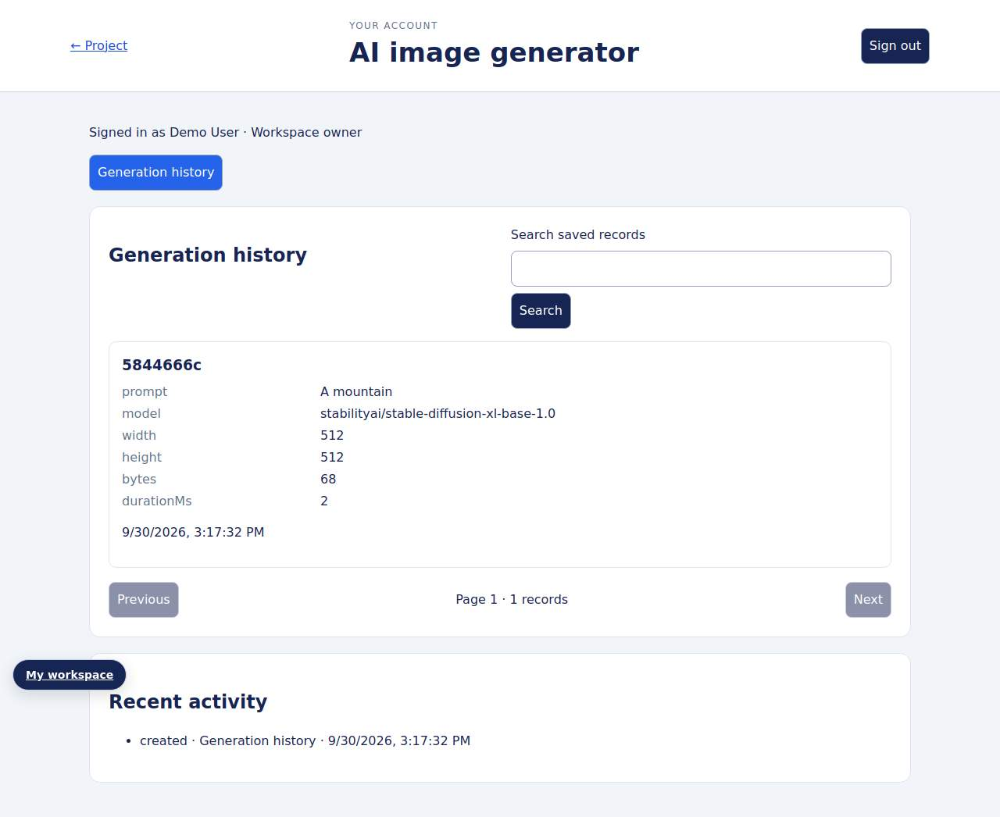

# AI image generator — full-stack project

Generate images through an authenticated provider route and keep successful generation metadata in your account.

**Frontend:** HTML, CSS, and JavaScript. **Backend:** Node.js 24, Express provider route, HTTP API, SQLite, and account sessions.

The authenticated Express route validates prompt, model, and dimensions, checks image content types, limits provider bytes to 20 MiB, and applies a timeout. Successful history records store prompt, model, dimensions, byte count, and duration. Image bytes are displayed/downloaded by the browser and are not permanently stored on the server.

## Run locally

```bash
npm ci
cp config/.env.example config/.env
# Set HF_TOKEN in config/.env
npm run start:api
```

Open <http://localhost:3000>, choose **Sign in · Account**, and create your local owner account. **My workspace** opens the stored workflows. The first account manages owner-only resources; later accounts receive member access and private account data.

## Implementation

- Salted scrypt password hashes, rotated HttpOnly sessions, seven-day expiry, and owner/member roles.
- SQLite-backed `generations` workflows with access checks and server-side validation.
- Connected account screens for saved records, search, paging, and activity; resource permissions control available actions.
- Transactional writes, retry keys, version-aware edits to mutable records, bounded requests, and protected server files.

[Routes, storage design, and access rules](docs/backend.md) · [Workspace preview](docs/workspace-preview.jpg)



## Verification

`npm run test:api` passes **3 backend tests**, covering account security, session expiry/persistence, access control, validation, and the repository workflow.

The account/resource flow passes browser checks at 375px and 1280px without page JavaScript errors or horizontal overflow in those flows. [GitHub Actions](.github/workflows/fullstack.yml) runs backend checks on pushes and pull requests.

## Provider setup

Keep `HF_TOKEN` on the server with inference permissions and any required model access. Frontend options match the backend allowlist. A supported provider/model and working credential are required for live generation; tests use mocked responses. [Provider documentation](https://huggingface.co/docs/inference-providers/providers/hf-inference).

## Project context

[Mustafa Sarwari](https://github.com/mustafa-sarwari) — junior full-stack developer building deeper frontend integration, server validation, authentication, database, and testing skills. The HTTP/account workspace foundation is reused across these portfolio projects; each project’s domain behavior is described above. Original community content, educational fixtures, and licenses remain attributed.

A Node runtime is required for accounts, persistence, provider proxies, and webhooks. Static previews show frontend assets. Demonstration orders do not process payments; stored requests are not emailed. Live provider/store credentials have not been exercised by the fixture tests.
